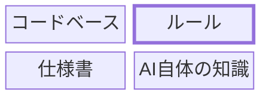

## 背景（As-Is）
- 前回の目標で実施した「中長期プロジェクトにおけるエージェントルール設計」を達成し、設計指針やルール体系を構築することができた。
- しかし、まだ社内で実際に利用できる段階には至っておらず、案件における運用ドキュメントや活用事例の整備が不足している。
- 現状では自分以外のメンバーが容易に使い始めることが難しく、活用の標準化・共有の仕組みづくりが今後の課題となっている。

## 目指す姿（To-Be）
- 社内案件で活用できるようにルール設計を整理し、導入可能な形に整備する。
- 案件への導入ガイド（活用方法・設計指針・サンプル含む）を作成し、チーム内で共有・フィードバックを得る。
- 最終的には「他メンバーがAI設計ルールを用いてプロジェクトに導入できる状態」を目指す。

## 成果物
- 案件への導入ガイド（esa）
- チーム共有用まとめ資料（導入・運用・効果）
    - 効果では定量的にどれくらいの時間の削減が見込めるかを明確にする

## 小目標
- [x] 前回のエージェントルール設計内容を整理し、社内案件でも利用できる構造へ再設計する
- [x] ナビパーク案件などで試験導入し、運用上の改善点を収集する
- [ ] 案件導入ガイドを作成し、他メンバーが参照可能な状態にする
- [ ] チーム内で共有する

---

## 参考にする記事

- [https://izanami.dev/post/47b08b5a-6e1c-4fb0-8342-06b8e627450a](https://izanami.dev/post/47b08b5a-6e1c-4fb0-8342-06b8e627450a)
    
- [https://github.blog/ai-and-ml/github-copilot/how-to-write-a-great-agents-md-lessons-from-over-2500-repositories/](https://github.blog/ai-and-ml/github-copilot/how-to-write-a-great-agents-md-lessons-from-over-2500-repositories/)
    
- [https://zenn.dev/imohuke/articles/ai-agent-rulefile-best-practices](https://zenn.dev/imohuke/articles/ai-agent-rulefile-best-practices)
    
- [https://zenn.dev/ncdc/articles/9bb22405eb9332](https://zenn.dev/ncdc/articles/9bb22405eb9332)
    
- ルールをignoreするコード
    

```bash
echo -e "AGENTS.md\\nCLAUDE.md\\nRULES_USAGE_LOG.md" >> .git/info/exclude
```

## ルール設計体系ガイドの方針

- **課題：**
    - ルールを設計してきて思ったこととしては、細かくルール定義してもメリットがないことがわかった
- **コンセプト：**
    - 実践で使って効果が体感できるルール設計、すぐに使える簡単なルール設計を記述する
    - AIが賢くなっても必ず必要となるルール設計ガイドにする
- **どんな成果物だと嬉しいか？**
    - すぐに試して効果が実感できる、実践的なルール
- **何を書くか？：**
    - 【書かない】
        - 「AIの性能に依存するルール」はガイドに書かない
        - ノウハウやテクニックなどは書かない
    - 【書く】
        - コードベースだけでは推測が難しい案件固有の知識
        - このプロジェクトでの正しさを決める基準
        - 暗黙知になっているNGパターン
- **効果検証**：
    - ナビパーク案件での体感的な5段階評価
    - どういう時にルールを導入すると最も効果が得られるかも記述する（導入推奨/導入任意）
    - 「効果がある」とはどういう状態のことか
        - コード生成によって発生する、実装の手戻りや抜け漏れ、バグを減らし、コーディングスタイルを守り、既存実装やビジネスルールを理解した実装ができること。
- **AIの能力ではなく、人とプロジェクトに依存するルール**
- **方向転換**
    - 包括的なルール体系ガイドは一時的な価値にしかならい
    - 一旦ごめんなさいする
- **安全なコード生成に導くためのルール設計**
    - **将来的なルールのあるべき姿**
        - ルール設計はコード生成の精度を上げるためのものではなく、何を守らせるか案件固有のガードレールを定義するもの
    - **ガードレール**
        - 何をルールに書いておくと安全にAIで実装できるか？
            - ガードレールに従うテクニックではなく、何を書けばいいかをまとめる
    - 守らないからレビュー負荷が高くなる
    - やりたくないこと、やってはいけないことを定義
    - AIが決めていいもの
    - 人が必ず判断すべきもの
    - AIは案を出すだけの領域

## ルールに書くこと

### 今まで

- コンポーネントについての説明
- 既存実装を参照するように指示
- コーディングルール

これらの指示は将来的に必要なくなる可能性

### これから

- ディレクトリ構成
- ユビキタス言語
- ビジネスドメイン

コードベースだけでは推測が難しい案件固有の知識を入れる

## ルール最小構成

### ルール以外にもプロジェクトに関する情報はある



### 構成

- 技術スタック（列挙程度）
- ディレクトリ構成（HOW/WHAT/WHY）
- ドメイン用語
- format/lint/testのコマンド
- ブランチ運用
- → 関数やコンポーネントの使い方はコードソース上に書く

## 1/23

- ガイドのコンセプトと構成を決める
- どことどのように連携できるかを考える（スターターキットや施策）

## 評価ポリシー

## ガイドの構成

- すぐ使える形にする
- ルールを書くコツ
- 運用

## 目次

- **現状の課題**
- **設計**
    - ルールのサンプル
    - 簡単な使い方
    - ルール導入効果
        - 5段階評価
- **運用**
    - 効果的な運用方法
        - 最小構成で運用を始める
            - 巨大なルールはエージェントにとってノイズである場合が多い
        - 運用しながらルールを改善
    - ルールの追加方法
        - 何を書いて・何を書かないか？
            - どういうところにはルールが必要ないのか？
        - 追加の判断基準
            - ルールに書く前にコード上に書けないか？
            - 期待に沿わない生成でもすぐにルールに定義しないほうがいい
    - ルールのベストプラクティス
        - 重要なルールは上部のセクションに書く
        - ルールは300行未満が理想
            - MCPのコンテキストを残しておく
            - コンテキストが圧迫するといい加減な結果を出力する
        - コードを用いた具体的なルールは冗長の場合が多いため書かない（抽象的に書く）

---

## ガイド

### 0. はじめに（このガイドで解決すること）

- AIコード生成で起きがちな失敗（手戻り／抜け漏れ／バグ／スタイル逸脱／既存ルール無視）の整理
- ガイドの適用対象：フロントエンド（例：React/Next/Vue 等）、チーム開発、既存コードベース
- “成果が出る条件”の定義：何を減らし、何を増やすか（例：差分の質、レビュー時間、バグ率）

### ルール

```markdown
## プロジェクト概要

ナビパークが運営する駐車場をオンラインで決済できるモバイルアプリケーションサービスのフロントエンド。
Nuxt3（SPA）で構築されたWebアプリケーションをFlutterアプリのWebview内で表示している。

## 使用可能なコマンド

- 型チェック実行: `npm run typecheck`
- Prettierチェック: `npm run lint:prettier`
- ESLintチェック: `npm run lint:script`
- Stylelintチェック: `npm run lint:style`
- ユニットテスト実行: `npm run test`
- ユニットテストをウォッチモードで実行: `npm run test:watch`
- CI用テスト実行: `npm run test:ci`
- カバレッジ計測付きテスト実行: `npm run coverage`
- E2Eテスト実行: `npm run e2e`

## 実装のガイドライン

実装・修正は以下のガイドラインに従って行なってください:

- 既存の実装とユーザーの要求の整合性が合わない場合は要求が間違いである可能性があるため、実装の前に迷わずユーザーに確認を取ること
- `function`は使わずアロー関数を使う
- any型を採用する以外に方法はないか検討する
- 定数の場合は既存の定数定義を確認する

## ドメイン用語

このプロジェクトでは、一般的な意味とは異なる定義で使われる用語が存在します。
**用語の意味は必ずここを正としてください。**

- **時間貸し**
  - 意味: 駐車場を時間単位で貸し出すこと（関連: 時間貸駐車場）
  - 英語: normal
  - 識別子: `normal`
- **月極**
  - 意味: 駐車場を月単位で貸し出すこと（関連: 月極駐車場）
  - 英語: monthly
  - 識別子: `monthly`
- **通知（お知らせ）**
  - 意味: アプリ内で配信される情報提供機能。
  - 英語: notice
  - 識別子: `notice`
- **プッシュ通知**
  - 意味: プッシュ通知機能。開封追跡機能あり
  - 英語: push, notification
  - 識別子: `push`
- **仮申込**
  - 意味: 月極駐車場の最初の簡易的な申込。本申込の前段階
  - 英語: pre application
  - 識別子: `preapplication`
- **本申込**
  - 意味: 仮申込後の正式な申込。署名・支払い・契約締結へと進む
  - 英語: application
  - 識別子: `application`
- **区画 / 車室**
  - 意味: 駐車場内の個別の駐車スペース
  - 英語: garage
  - 識別子: `garage`, `garageNumber`
- **定期利用券（パス）**
  - 意味: 一定期間特定の駐車場が使い放題になる券
  - 英語: Pass
  - 識別子: `Pass`, `UsersPass`
  - 参照: [features/pass/](src/features/pass/)
- **出庫決済**
  - 意味: 時間貸し駐車場から車を出す際の精算
  - 英語: Exit Parking Payment
  - 識別子: `EXIT_PARKING`
- **初期費用**
  - 意味: 月極契約開始時に支払う初回費用（契約手数料・保証金・日割り料金などの合計）
  - 英語: Initial Payment
  - 識別子: `InitialPayment`
- **夢なびポイント**
  - 意味: 夢なびサービス共通のポイント。決済に充当可能
  - 英語: Yumenavi Point
  - 識別子: `YumenaviPoint`
  - 参照: [features/yumenavi/](src/features/yumenavi/)
- **アカウント種別**
  - 意味: 個人会員か法人会員かの区分
  - 英語: Account Type
  - 識別子: `ACCOUNT_TYPES: PERSONAL / CORPORATION`

## 技術スタック

### コアフレームワーク・コアライブラリ

- [Nuxt3](<https://nuxt.com/docs/3.x/>)
- [TypeScript](<https://www.typescriptlang.org/docs/>)
- [Node.js 20.x](<https://nodejs.org/docs/latest-v20.x/api/>)
- [Vite](<https://vitejs.dev/guide/>)
- [Tailwind CSS](<https://tailwindcss.com/docs>)
- [yup](<https://github.com/jquense/yup>)
- [vee-validate](<https://vee-validate.logaretm.com/v4/>)
- [AWS Amplify](<https://docs.amplify.aws/>)
- [MSW](<https://mswjs.io/>)

### テスト系

- [Vitest 4](<https://vitest.dev/>)
- [Playwright](<https://playwright.dev/>)

## ディレクトリ構成

このプロジェクトは **Package by Feature** アーキテクチャを採用しています。
機能ごとに関連するすべてのコード（API、コンポーネント、ロジック、型定義など）を1つのディレクトリにまとめ、機能の独立性と保守性を意識した設計になっています。

### 全体

```

src/ ├── api/ # API層の共通実装 ├── assets/ # スタイルシート（Tailwind CSS） ├── components/ # 再利用可能なUIコンポーネント ├── composables/ # Vue Composables（ロジック・状態管理） ├── config/ # アプリケーション設定 ├── constants/ # グローバル定数 ├── features/ # 機能別モジュール（Package by Feature） ├── layouts/ # Nuxtレイアウト ├── middleware/ # Nuxtミドルウェア ├── mocks/ # MSWモック設定 ├── pages/ # Nuxtページ（ファイルベースルーティング） ├── plugins/ # Nuxtプラグイン ├── public/ # 静的アセット ├── repositories/ # APIクライアント ├── test/ # テスト設定 ├── types/ # TypeScript型定義 └── utils/ # ユーティリティ関数

```

### 主要ディレクトリの責務

#### **features/** - 機能別モジュール（最重要）

**Package by Feature** の中核となるディレクトリ。各機能が独立したモジュールとして管理されます。

**feature内部構造:**

```

features/{feature-name}/ ├── api/ # 機能別API実装 │ ├── {feature}Repository.ts │ └── types/ # API型定義 ├── components/ # 機能専用コンポーネント ├── composables/ # 機能専用Composables（ロジック） │ ├── store/ # useStoreで状態管理 ├── constants/ # 定数定義 │ ├── index.ts │ └── schemas.ts # Yup検証スキーマ ├── mock/ # MSWモック実装 ├── model/ # ドメインモデル ├── utils/ # 機能専用ユーティリティ └── types/ # 機能型定義

### 1. ルール設計の原則（少ないルールで最大効果を出す）

- **ルールは「AIが守れる形」に落とす**（曖昧語を避ける、出力形式を固定する、優先順位を明記）
- **3層構造**：①必須（品質/事故防止）②推奨（生産性）③任意（好み）
- **失敗駆動**：過去の手戻り・レビュー指摘を“ルール化候補”にする
- **局所最適を避ける**：プロジェクト固有ルールとチーム共通ルールの分離

---

### 2. まず入れる「最小ルールセット（MVP）」— 今日から使える

> 最初に入れるべきルールを固定化して、どのPJでも即適用できるテンプレ章

- MVPルールの狙い（事故が減る/レビューが楽になる）
- MVPの構成（例）
    - 実装前確認（要件・既存実装・影響範囲）
    - コーディング規約・ディレクトリ・命名
    - 型/エラーハンドリング/アクセシビリティ/国際化など最低ライン
    - テスト（最低限の単体/スナップショット/型テストなど）
    - 変更範囲の制約（無関係なリファクタ禁止 等）
- 「MVPルール」の**コピペ用テンプレ**（Copilot/Cursor形式のひな形置き場）
- MVP導入の手順（30分で入れる手順）

---

### 3. ルールを増やすときの設計パターン集（実践で効く）

> “よくある失敗”→“効くルール”に変換する辞書章

- パターン例（章の枠だけ先に用意）
    1. **既存実装逸脱を防ぐ**（既存の hook / API client / state 管理を強制）
    2. **ビジネスルールの取りこぼし防止**（仕様参照の必須化、チェックリスト出力）
    3. **バグを減らす**（境界値、null/undefined、非同期、race、memoization）
    4. **スタイル/設計統一**（コンポーネント責務、層分離、禁止事項）
    5. **レビュー効率**（差分説明フォーマット、自己レビュー項目）
- 各パターンのテンプレフォーマット
    - 症状（何が起きる？）
    - 原因（なぜAIがやる？）
    - ルール（短く、強制可能に）
    - 例（良い/悪いプロンプト、良い/悪い差分）
    - 導入コスト / 副作用

---

### 4. ルールの「書き方」ガイド（Copilot/Cursorに最適化）

- ルールの粒度（1ルール=1判断にする）
- 優先順位の付け方（例：既存実装＞コーディング規約＞好み）
- 禁止/推奨/条件付きの書き分け
- AIが迷うポイントの潰し方（例：参照先ファイルを指定、探索手順を明記）
- 出力形式の固定（例：「最初に計画→差分→テスト観点」）
- “ルール地獄”を避ける編集指針（上限、重複排除、例外の扱い）

---

### 5. プロジェクト導入の手順（運用で失敗しない）

- 導入ステップ（例：MVP導入→1週間観測→追加ルール）
- 役割分担（オーナー、レビュアー、更新権限）
- ルールの置き場所（リポジトリ内のどこに置くか）
- 変更管理（PR運用、変更理由テンプレ）
- 新規参加者オンボーディング（最初に読むもの）

---

### 6. “AIに渡すコンテキスト”設計（ルールより効く土台）

> ここが弱いとルールがあっても「理解した実装」になりにくい

- 必須コンテキストの4点セット
    - アーキテクチャ概要（層、責務、依存関係）
    - ディレクトリマップ
    - 主要な既存実装の参照先（UI/状態/API/エラー/ログ）
    - ビジネスルールの一次情報（仕様/ドメイン用語集）
- “参照させる順序”の設計（先に読むファイル）
- 仕様が散らばっている場合の最低対策（README/ADR/Glossaryの整備）

---

### 7. 実践ワークフロー（エンジニアが迷わない手順書）

- 依頼テンプレ（AIへの指示テンプレ）
- 実装の進め方テンプレ（探索→計画→実装→自己レビュー→テスト観点）
- PR説明テンプレ（AI生成差分の説明）
- レビュー観点（人間が見るべき箇所を固定）
- 禁止例（AIにやらせない／危険な変更）

---

### 8. ルールの評価と改善（効果が体感できるようにする）

- 指標例（レビュー指摘数、手戻り回数、バグ件数、リードタイム）
- “良いルール/悪いルール”判定基準
- 追加・削除・分割の基準
- 定期メンテ（例：月1で棚卸し）

---

### 9. 付録（コピペで使えるテンプレ集）

- 最小ルールセット（Copilot / Cursor それぞれ）
- パターン別ルールテンプレ
- プロンプトテンプレ（機能追加/バグ修正/リファクタ/テスト追加）
- チェックリスト（アクセシビリティ、i18n、セキュリティ、パフォーマンス）
- よくある質問（「守られない」「遅くなる」「例外対応」など）

---

## この構成のポイント（コンセプトとの整合）

- **「すぐに使える」**：2章のMVPが最短で成果を出す入口
- **「実践で効果が体感できる」**：3章（失敗→ルールの辞書）と8章（効果測定）で“効いた”が見える
- **プロジェクトごと導入**：5章の導入手順＋9章テンプレで横展開しやすい
- **既存実装/ビジネスルール理解**：6章で“参照させる情報設計”を独立させて強化

---

次のステップとしては、いきなり全部を埋めるより、**2章の「最小ルールセット（MVP）」の中身**を先に決めるのが一番早く価値が出ます。

このあとこちらから、MVPを「10〜15個の短いルール（+出力フォーマット）」として具体案まで作って、そのまま Copilot Instructions / Cursor Rules に貼れる形に落としていきます。