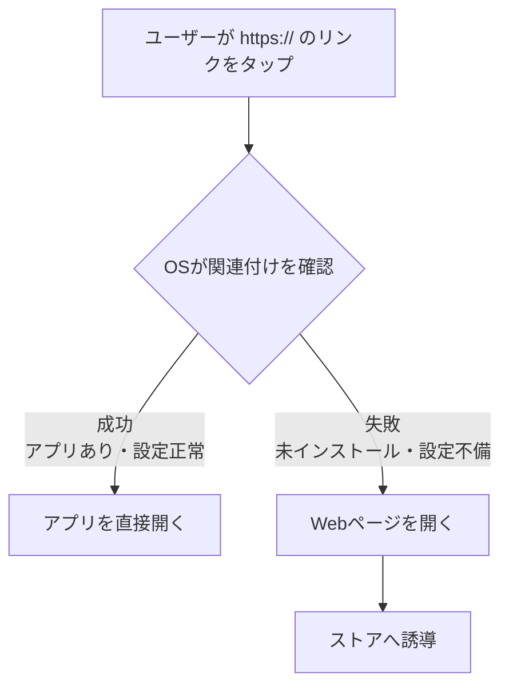
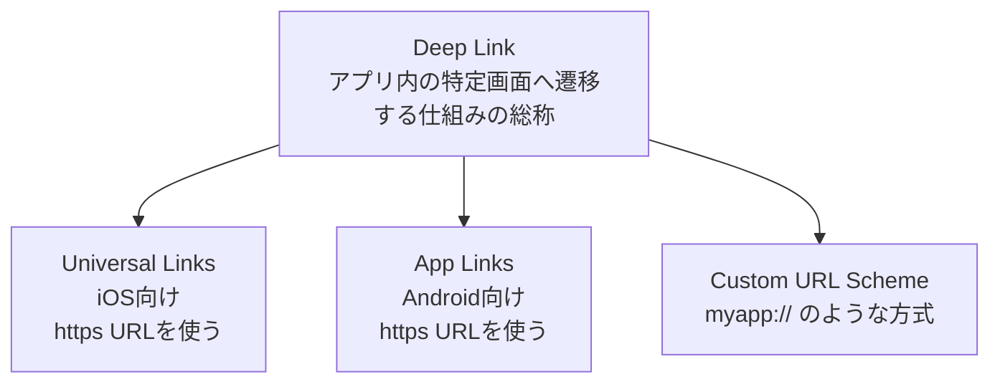

https://zenn.dev/hsylife/articles/72edd8b6234576

## 概要
- リポジトリ: https://github.com/sonicmoov/navipark-static
- backlog: https://sonicmoov.backlog.jp/view/STARTS_NAVIPARK_SMV-2563

## 目的
Universal Links (iOS) と App Links (Android) でアプリを開き、開けなかった場合（アプリがインストールされていない場合）はフォールバックでWebを開いて、そこからストアへ誘導する。



## 発生している問題
iOS端末でカメラアプリを使ってQRを読み込んだ場合、アプリがインストールされているにも関わらず、ストアが立ち上がってしまう。

## 考えられる原因
アプリに遷移させるかストアに遷移させるかを正常に動作させるためには、Universal Links と App Links の両方を navipark-static に実装しないといけないが、現状は App Links が機能していないため、アプリがインストールされていてもストアに遷移してしまう問題が発生している。

## 対応方針
  アプリが正しく関連付けされていて、端末に入っていれば、https://... を踏んだ時点で
  Webを経由せずそのままアプリ が開きます。

  Webが先に開くのはフォールバック時 です。つまり、アプリ未インストール・関連付け不備
  ・設定不備のときだけ、そのURLがブラウザで開きます。


  今の navipark-static 「一度Webを開いて `comnaviparkapp://` に変換する踏み台」で、 `index.html` と `complete-sign-in.html` もその前提です。
  Safari経由時の不安定さはこの構成と相性が悪いです。

対応する場合、https:// を iOSは Universal Links、Androidは App Links で直接アプリに渡し、Webは未インストール時のフォールバック専用 にするのがよいです。

## Deep Linkとは




- カスタムスキーマを使う方がdeeplink
- applinkはもう使わない
	- applinkが間違って機能してしまっている
- applinkとuniversallinkを正常に機能させるにはアプリ側も修正
	- flutter: 1日くらい
- navipark-staticではストアに飛ぶだけの処理にして、アプリに飛ばす処理は
- 全体で3人日くらいあったらできそう

AIのまとめなんですがこんな感じです。

App Links（Android）やUniversal Links（iOS）を使って、「アプリがインストールされていればアプリを開き、インストールされていなければアプリストアに飛ばす」という挙動を実現するには、いくつかの方法があります。
前提として、App LinksやUniversal Linksは、アプリが入っていない場合は「設定したWebページのURLがそのままブラウザで開く（フォールバック）」という仕組みになっています。そのため、ストアに飛ばすには「開いたWebページ上で、ストアへ誘導する」のが基本的な考え方です。

自前でフォールバック用Webページを作り、JSでリダイレクトする
一番オーソドックスで、コストをかけずに自前で実装する方法です。App Links / Universal Links のリンク先となるWebページを用意し、そこにJavaScriptを書いておきます。
ユーザーがリンクを踏む
アプリが入っていれば、そのままアプリが開く
入っていなければ、ブラウザでWebページが開く
WebページのJavaScriptがOSを判定し、各ストアへ自動リダイレクトする
▼ 実装イメージ (HTML/JavaScript)

```
<!DOCTYPE html>
<html lang="ja">
<head>
<meta charset="UTF-8">
<title>アプリストアへ移動中...</title>
<script>
  window.onload = function() {
    var userAgent = navigator.userAgent || navigator.vendor || window.opera;

    // iOS (iPhone, iPad, iPod) の場合
    if (/iPad|iPhone|iPod/.test(userAgent) && !window.MSStream) {
        window.location.href = "https://apps.apple.com/jp/app/あなたのアプリID";
    } 
    // Android の場合
    else if (/android/i.test(userAgent)) {
        window.location.href = "https://play.google.com/store/apps/details?id=あなたのパッケージ名";
    } 
    // その他の端末（PCなど）の場合はそのままWebサイトを表示するか、LPへ飛ばす
    else {
        window.location.href = "https://xn--weburl-h43eiirdubd16d2gyj";
    }
  };
</script>
</head>
<body>
  <p>アプリストアへ移動しています。移動しない場合は<a id="store-link" href="#">こちら</a>をタップしてください。</p>
</body>
</html>
```
