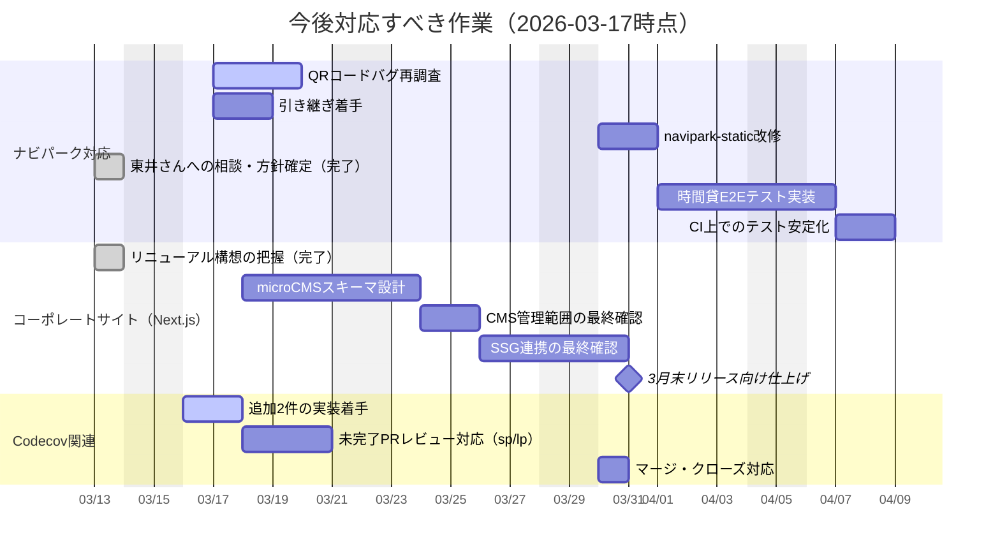

```mermaid
gantt
    title 今後対応すべき作業（2026-03-17時点）
    dateFormat  YYYY-MM-DD
    axisFormat  %m/%d
    excludes    weekends

    section ナビパーク対応
    QRコードバグ再調査               :active, nav_bug, 2026-03-17, 3d
    引き継ぎ着手                     :nav_handover, 2026-03-17, 2d
    navipark-static改修              :nav_static, 2026-03-30, 2d
    東井さんへの相談・方針確定（完了）    :done, nav_consult, 2026-03-13, 1d
    時間貸E2Eテスト実装               :nav_e2e, after nav_static, 4d
    CI上でのテスト安定化               :nav_ci, after nav_e2e, 2d

    section コーポレートサイト（Next.js）
    リニューアル構想の把握（完了）      :done, corp_plan, 2026-03-13, 1d
    microCMSスキーマ設計              :corp_schema, 2026-03-18, 4d
    CMS管理範囲の最終確認             :corp_scope, after corp_schema, 2d
    SSG連携の最終確認                 :corp_ssg, after corp_scope, 3d
    3月末リリース向け仕上げ            :milestone, corp_release, 2026-03-31, 0d

    section Codecov関連
    追加2件の実装着手                 :active, codecov_impl, 2026-03-16, 2d
    未完了PRレビュー対応（sp/lp）       :codecov_review, after codecov_impl, 3d
    マージ・クローズ対応               :codecov_merge, 2026-03-30, 1d

```
