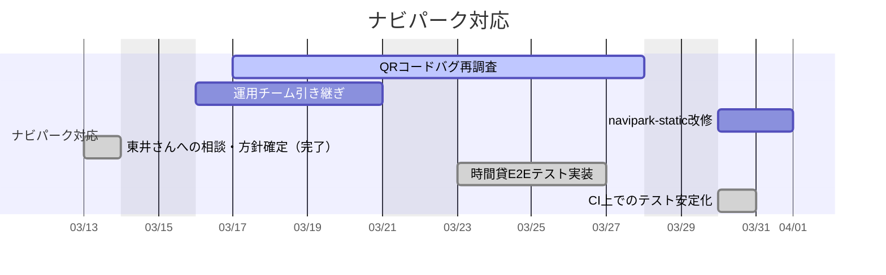
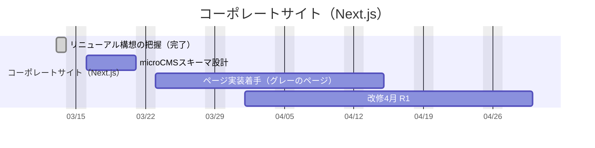
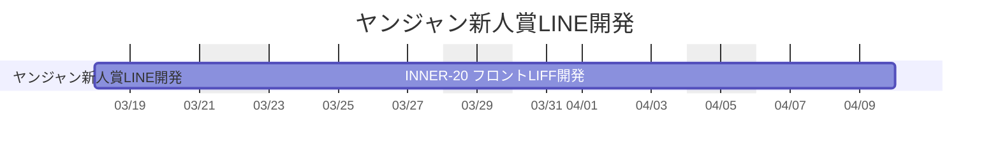
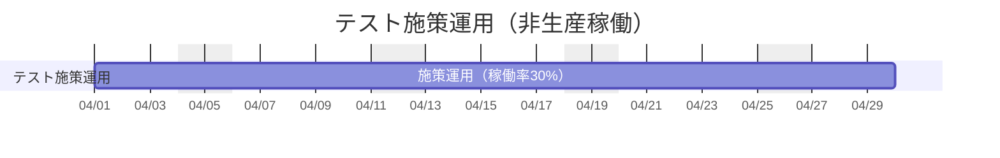
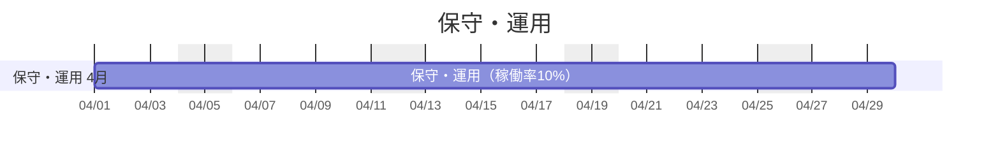
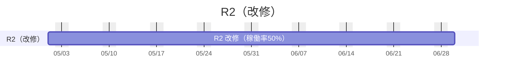

## 更新ルール
- section配下のtaskはインデント(半角スペース4つ)をつける
- mermaidの[仕様](https://mermaid.js.org/syntax/gantt.html)に従う
- [フロントエンドリソース管理 - Backlog](https://sonicmoov.backlog.jp/find/FEU_RES): 親課題に案件情報、小課題にアサインと期間と工数が載っています

