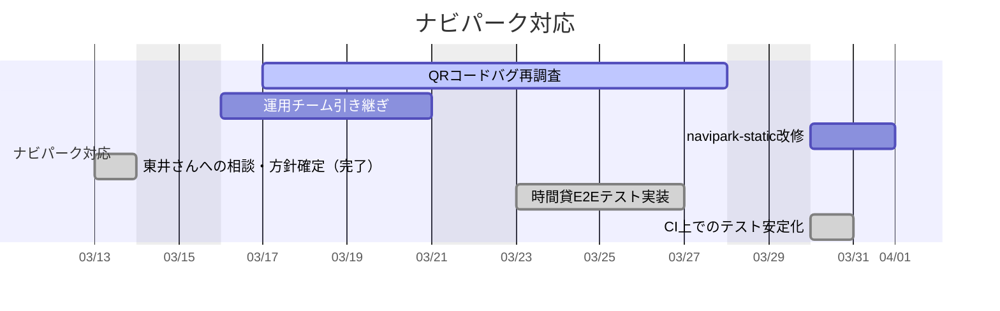
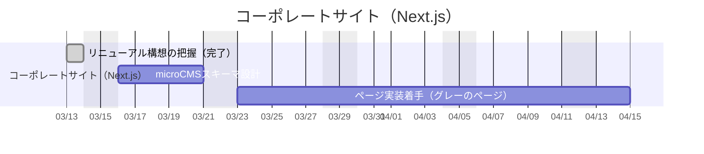
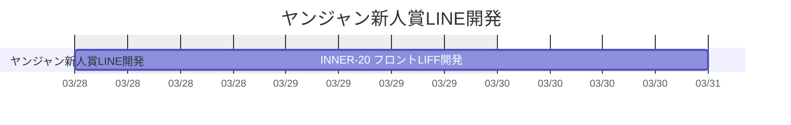
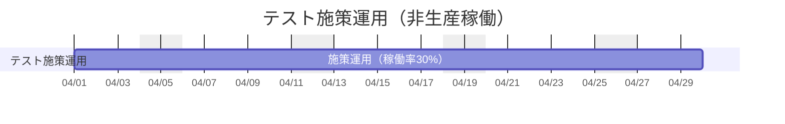

## 更新ルール
- section配下のtaskはインデント(半角スペース4つ)をつける
- 仕様に従う： https://mermaid.js.org/syntax/gantt.html

```mermaid
gantt
    title ナビパーク対応
    dateFormat  YYYY-MM-DD
    axisFormat  %m/%d
    excludes    weekends

    section ナビパーク対応
        QRコードバグ再調査               :active, nav_bug, 2026-03-17, 9d
        運用チーム引き継ぎ                     :nav_handover, 2026-03-16, 5d
        navipark-static改修              :nav_static, 2026-03-30, 2d
        東井さんへの相談・方針確定（完了）    :done, nav_consult, 2026-03-13, 1d
        時間貸E2Eテスト実装               :done, nav_e2e, 2026-03-23, 4d
        CI上でのテスト安定化               :done, nav_ci, 2026-03-30, 1d
```

```mermaid
gantt
    title コーポレートサイト（Next.js）
    dateFormat  YYYY-MM-DD
    axisFormat  %m/%d
    excludes    weekends

    section コーポレートサイト（Next.js）
        リニューアル構想の把握（完了）      :done, corp_plan, 2026-03-13, 1d
        microCMSスキーマ設計              :corp_schema, 2026-03-16, 5d
        ページ実装着手（グレーのページ）    :corp_gray, 2026-03-23, 2026-04-15
```

```mermaid
gantt
    title ヤンジャン新人賞LINE開発
    dateFormat  YYYY-MM-DD
    axisFormat  %m/%d
    excludes    weekends

    section ヤンジャン新人賞LINE開発
        INNER-20 フロントLIFF開発           :shu_liff, 2026-03-28, 2d
```

```mermaid
gantt
    title テスト施策運用（非生産稼働）
    dateFormat  YYYY-MM-DD
    axisFormat  %m/%d
    excludes    weekends

    section テスト施策運用
        施策運用（稼働率30%）              :施策_april, 2026-04-01, 2026-04-30
```
