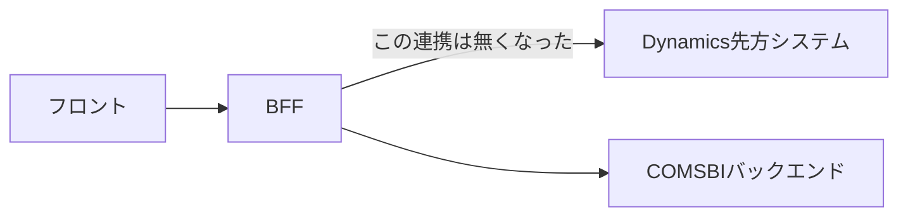

- コンバテックジャパンとは人工肛門のメーカー
	- ストマー
	- 利用者、医療従事者などがステークホルダー
- 初回登録　ポイント発行
- Dynamics連携：Microsoft Dynamics 365のこと

## Figma
- [Figma](https://www.figma.com/board/IO9xxTw3iF6vY7hH8gW9zE/%E3%82%B3%E3%83%B3%E3%83%90%E3%83%86%E3%83%83%E3%82%AF%E3%82%B8%E3%83%A3%E3%83%91%E3%83%B3?node-id=148-555&p=f&t=Xdy3q8hMQ564M5Nc-0)
  
## 見積もり
- [見積もりスプシ](https://docs.google.com/spreadsheets/d/17RvqOtq5g76Ji6zZav9kd44OYwfa6lw0y4GohpptYQI/edit?gid=1120307034#gid=1120307034)

## 議事録
- [[【社内】コンバテック見積もり確認 - 2026_06_19 15_29 JST - Gemini によるメモ]]

## 構成

フロント → BFF? → COMSBIバックエンド
Dynamics（先方システム）

## 実装
- マイページ
	- マイページのデータ取得はSaaSのAPIから呼び出す
	- credentialsをフロントで持つ必要あり？（LIFF認証トークンでやりとりするはず）
- 登録画面
- リッチメニュー
- ポイント確認画面
- ストーマの番号入力
	- シリアルは定数でもつ
- 商品管理DBいる
- ポイント利用履歴
	- 一括取得は100件までなのでページネーションの実装が必要
- クーポンとポイントの管理をやる
	- 現状のCOMSBI SaaSでは管理画面からしかクーポン使用を適用できない
	- SaaSだけで完結させたい

## 画像解析について
OCRの件についてユニットに確認してみたところ、バーコードやQR読み取りの実績はありましたが、固有のシリアルナンバーの読み取りは実績がなさそうとのことでした。  
結論としては、バックエンド側でライブラリ(Tesseract等)を使うか、Geminiに画像解析させるのが良さそうです。  
フロントで実装する場合は、ライブラリ調査・フィジビリ検証からとなりそうです。

---
## 6/19 見積もりMTG
- かしくらさん, 平岡さん, 岡村さん
- 15:30~16:40
- 全体サマリー
	- MTGの目的としてはポイント履歴の追加実装の見積もりと全体の見積もりの確認である。
	- 結果として、現状は要件定義がかなりざっくりしているため、できるところのみ確認し後は先方と再度確認が必要 → 工数も膨らむ可能性
- 前提の認識
	- フロントはデータとってくるのみ前提だった
	- バックエンドBFFは介さない前提だった → 後日、BFF必要と判定した
- 不確定要素
	- 商品を選んで使用する
		- 処理が見積もりに入ってない → まだ見積もりに入ってないが要件定義に絶対に必要になる
	- BFF必要性
		- フロントの呼び出し方によってはBFFが必要になる
		- BFFが必要な場合も見積もりシートに追加したが、必要であればその工数分上乗せされる
		- → バンクさん確認中
	- 商品やシリナルナンバーの管理
		- 商品やシリアルナンバーは定数として固定で管理するという話だった記憶が曖昧
	- ポイント履歴
		- ポイント履歴以外は予算決定して進む予定
		- バックエンド必要？
- シリアルナンバーの画像入力は無くなった → 手入力一本
